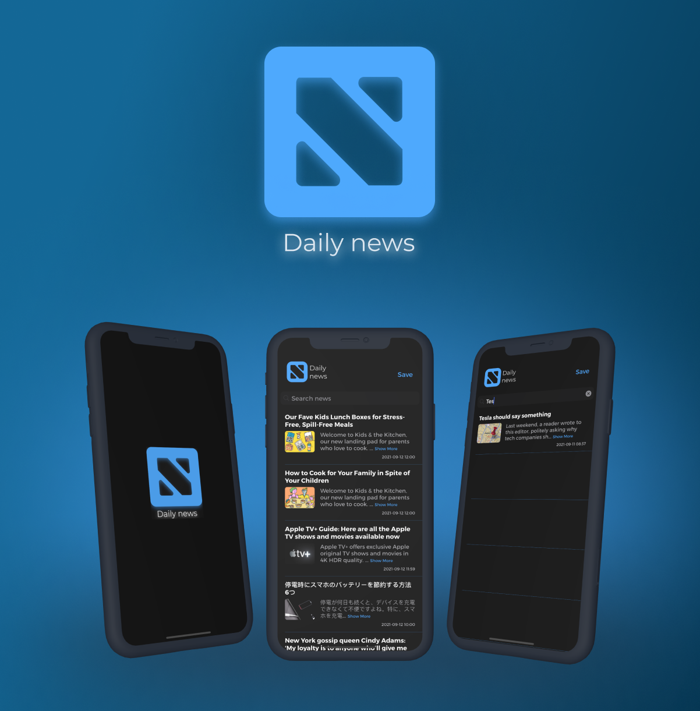
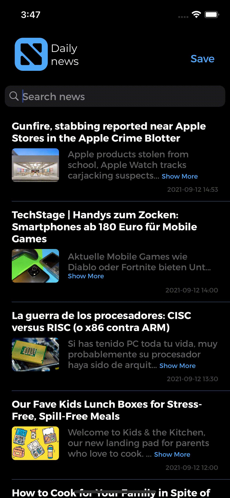

<h1 align="center">

</h1>

## Introduction

Hi, my name is George. I'm glad to see you on my [GitHub](https://github.com/gbasovv?tab=repositories).

## Features

The app looks like single-view application which displays list of news. This news we are getting from free News API https://newsapi.org. This app built with MVC architecture pattern.

The application is very simple and straightforward for the user. It consists of the following features:
- viewing news;
- saving these news to the phone (at the request of the user);
- searching by headlines.

News can be viewed both for the last day and for the whole week. They are conveniently sorted by date. Initially, the news for the last day is shown, but scrolling down, the rest will be loaded using pagination. The whole application was made using native features:
- URLSession was used to receive data from the server;
- for saving - userdefaults;
- for searching - UISearchBar.

To read the news, we click on the cell and the full article opens in the browser.

You can save downloaded news to your phone, if you want to read it later. To save this news you should click button "Save". For example, you can read it when you have bad internet connection or haven't got it at all. Also you can use searchBar to find news which you have saved before.

## Examples

- #### Run app

- #### Open article in the browser

- #### Refresh data

- #### Pagination

- #### Search data

## Links
- [LinkedIn](https://www.linkedin.com/in/gbasovv/)
- [CV](https://rabota.by/resume/70c51207ff0937633f0039ed1f58594949746f)
- [GitHub](https://github.com/gbasovv?tab=repositories)
